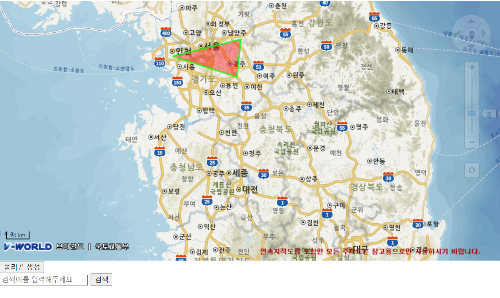

# Dev-Lab 📘
실무에 도움이 될만한 기능을 실습합니다.

## Redis 
- 캐싱 시간을 설정하여 캐싱 기능을 활성화시킨다.
- Access Token & Refresh Token 값을 로컬스토리지와 쿠키에 저장한다.
- 구글로 로그인을 가능하게 한다.
- 후에 카카오, 네이버 로그인 추가
- 
## RabbitMQ

## Vmap-Polygon

## Scheduler

## OAuth
- Spring Security
- Access Token & Refresh Token 값을 로컬스토리지와 쿠키에 저장한다.
- 구글로 로그인을 가능하게 한다.
- 후에 카카오, 네이버 로그인 추가
