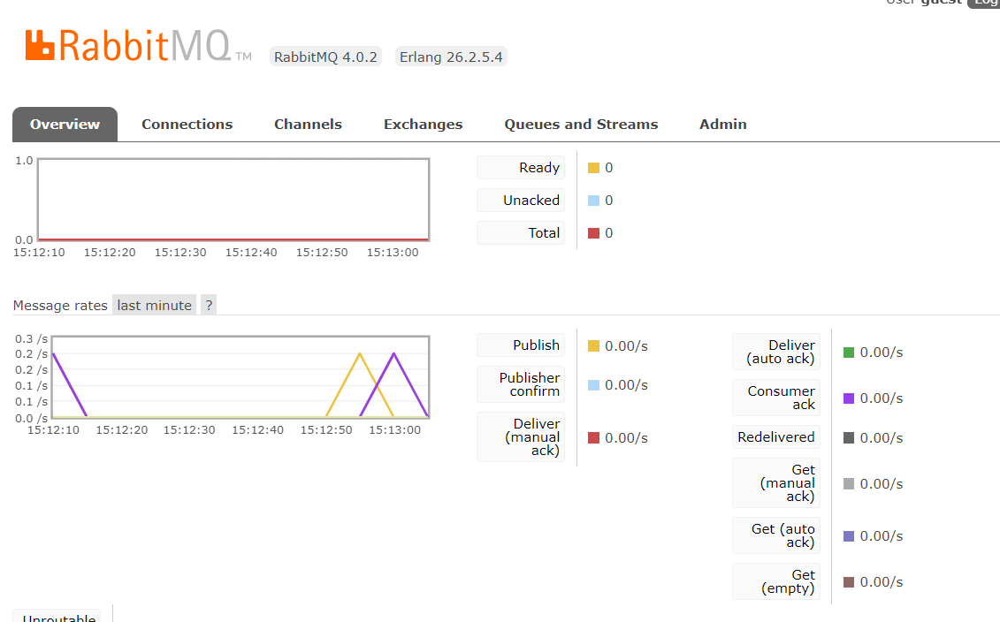

# Dev-Lab 🐇
실무에 도움이 될만한 기능을 실습하고 습득합니다.

<div align=center><h2>📚 STACKS</h2></div>
<div align=center> 
   
   
   
   
  <br>

  
  
  
  <br>
  
  
  
</div>

## Redis 
- **캐싱** 시간을 설정하여 캐싱 기능을 활성화시킨다.
- **세션 클러스터링**을 구축하여 로그인한 사용자의 정보를 저장한다.
  - 세션을 Redis에 저장하게 되면 분산환경에서의 세션 동기화 문제가 해결된다.
- RDS의 부담도 줄어들고 성능도 크게 향상하게 된다.

## RabbitMQ
- 실습구현화면

- AMQP(Advanced Message Queuing Protocol)를 구현한 오픈소스 메세지 브로커. PRODUCERS에서 CONSUMERS로 메세지(요청)를 전달할때 중간에서 브로커 역할을 한다.
- 해당하는 요청을 다른 API에게 위임하고 빠른 응답을 할 때 많이 사용한다.

## Vmap-Polygon

- V-map에서 제공하는 지도오픈API를 사용하여 폴리곤을 생성한다.
- 도로명으로 주소를 검색하여 생성한 폴리곤에 해당 주소가 포함되어지는지 체크한다.

## Scheduler
- 대량의 데이터 처리를 위한 경량화된 프레임워크 반복적으로 수행하는 일괄처리 작업을 효율적으로 처리할수있는 기능을 제공 대용량 데이터 처리에 적합한 분산 방식의 처리를 지원한다.
```
 	  @Async
    @Scheduled(cron = "0 59 23 * * *")
    public void saveAttend(){
        attendService.saveAll(); //매일 저장
        teamManagementService.deleteUser();//매일 체크리스트 몇일 연속 퍼센테지 0퍼인 사람 확인 후 삭제
    }
```

## OAuth
- WebClient를 이용한 Http통신
- 카카오/네이버/구글/애플 로그인 구현

### 스프링이벤트를 이용한 도메인 의존성 분리 실습
